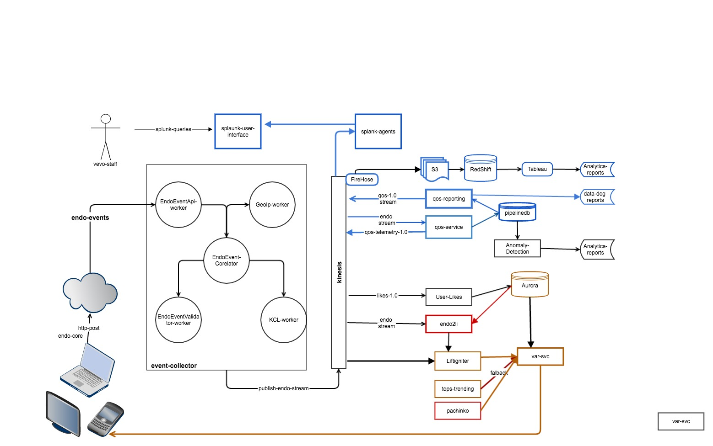
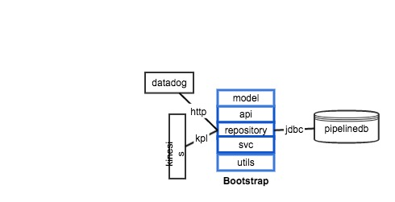

qos-reporting
=====
qos-reporting is the 2nd component of the QOS effort.  This service is downstream from [qos-service](https://github.com/kayvank/qos-service).  qos-reporting main products are: 

- datadog reports
- redshift seed data to drive qos related ETLs

#### Requirements

* JDK 1.8
* Scala 2.11.7+
* Scalaz 2.7.2
* sbt 13.11


#### Highlevel

qos reporting has the followign tasks: 

- executes query taks against pipelinedb qos related views
- transform and publishe query results to
  - [datadog](https://app.datadoghq.com/dash/252035/qos-global?live=true&page=0&is_auto=false&from_ts=1488404938524&to_ts=1488408538524&tile_size=m)


#### Internal

qos-reporting utlizes [Scalaz stream](https://github.com/scalaz/scalaz) where the stream 

- source is continues queries against pipelinedb views
- sink is kinesis stream and datadog endpoint

[qos-1.0 stream](https://console.aws.amazon.com/kinesis/home?region=us-east-1#/streams/details?streamName=qos-1.0) is confugred to use:

 - [firehose qos-1.0](https://console.aws.amazon.com/firehose/home?region=us-east-1#/details/qos-firehose?edit=false) 
 - lambda to archive the data to 



##### Anatomy of project packages:

- model: domain model & JSON protocol converters
- api: this package contins http related stuff. At this time we only supprt status reporting
- repository: related code for the "sink", database, datadog & kinesis stream
- svc: service layer that disseminates stream products to multiple sinks
- utils: implicits, threading model and converters

#### setup
```
git clone https://github.com/kayvank/qos-reporting
sbt clean compile  // to build prject
sbt test // unit test
sbt it:test // integration test
sbt clean compile universal:packageBin // to generate an executable
sbt clean compile docker:publishLocal
```

#### To run the prject localy
The folowing is required for running the project locally, 

1. set up your environment variables
2. pipelinedb & configure pipelinedb
3. qos-servcie 

##### Configuration

The following environment variables must be set:
```
export JDBC_URL='jdbc:postgresql://0.0.0.0/qos'  ### ASSUMING YOU'RE USING pipelinedb docker image 
export JDBC_USER=my_very_special_user
export JDBC_PASSWORD=my_secrete_password
export AWS_ACCESS_KEY_ID=my_aws_key
export AWS_SECRET_ACCESS_KEY=my_aws_secret
```

##### Required docker-images

pull & run 

- piplinedb image
- qos images
  - qos-service
  - qos-reporting


##### pipelineDB

- pull down pipelineDB  docker image:
```
docker run  -it --rm -v pgdata:~/var/lib/postgresql/data
docker run -d -p 5432:5432 -v pgdata:/Users/<MY_USER_NAME>/var/lib/postgresql/data pipelinedb/pipelinedb
```

- create ~/.pgpass for ease of login, see references for detail

```
0.0.0.0:5432:pipline:pipeline:pipeline
```

- create user & database
```
CREATE USER qos WITH PASSWORD 'qos' CREATEDB;
create database qos owner qos;
```

### project links

[qos-1.0 stream](https://console.aws.amazon.com/kinesis/home?region=us-east-1#/streams/details?streamName=qos-1.0)

[qos-firehose](https://console.aws.amazon.com/firehose/home?region=us-east-1#/details/qos-firehose?edit=false)

[pipelinedb-sql](http://52.90.166.74/pipeline.qos_queries.backup.sql.txt)

[pipelinedb-temporal-views](http://52.90.166.74/pipeline.qos.schema.backup.sql.txt)


### References

[datadog](http://docs.datadoghq.com/api/#metrics-post)

[pipelinedb](https://www.pipelinedb.com/)

[kinesis KPL](http://docs.aws.amazon.com/streams/latest/dev/kinesis-kpl-config.html)

[kubernetes](http://docs.aws.amazon.com/streams/latest/dev/kinesis-kpl-config.html)

